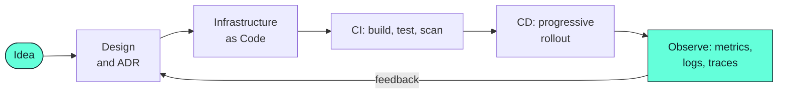

<div align="center">


[](https://atharvv.me)

[](https://atharvv.me)
[](https://linkedin.com/in/atharv2405)
[](mailto:atharv1324@gmail.com)

[](https://github.com/isnowjug?tab=followers)
[](https://github.com/isnowjug)

</div>

---

## 🧭 About Me

I build the invisible layer that keeps software running — pipelines, infrastructure, and the automation
in between. I care about **reproducible environments**, **short feedback loops**, and **boring deploys**.

```yaml
apiVersion: humans.dev/v1
kind: Engineer
metadata:
  name: atharv-shukla
  labels:
    role: cloud-devops-engineer
    location: india
spec:
  languages:     [Go, Python, JavaScript, Java, Bash]
  clouds:        [AWS, GCP, Azure]
  platform:      [Kubernetes, Docker, Terraform, GitHub Actions]
  observability: [Prometheus, Grafana, OpenTelemetry]
  currentlyBuilding: "self-healing deployment pipelines"
  currentlyLearning: [Rust, "Platform Engineering", "eBPF"]
  askMeAbout:    ["k8s debugging", "IaC patterns", "CI/CD", "photography"]
  funFact:       "I still debug with print statements — and I'm not sorry 🐛"
status:
  phase: Running
  openToCollaborate: true
```

<div align="center">

| 🔭 Building | 🌱 Learning | 🤝 Collaborating | 🎯 Exploring |
| :---------- | :---------- | :--------------- | :----------- |
| Deployment automation | Rust & WebAssembly | Open source infra tools | Platform engineering |
| Cloud-native services | Distributed systems | Developer experience | AI in DevOps |
| Observability stacks | System design | Community projects | Edge computing |

</div>

---

## ⚙️ How I Work



> **Principle:** if I have to do it twice, it gets scripted. If it breaks twice, it gets a dashboard and an alert.

---

## 🧰 Tech Stack

<div align="center">

**Languages**


**Cloud & Infrastructure**


**Containers & Delivery**


**Observability & Data**


</div>

<details>
<summary><b>🖥️ Also comfortable with — the application side</b></summary>

<br/>

<div align="center">


</div>

</details>

---

## 📊 GitHub Analytics

<div align="center">


</div>

---

## 💬 Dev Quote of the Day

<div align="center">


</div>

---

## 🤝 Let's Connect

<div align="center">

Always up for a conversation about infrastructure, open source, or a good debugging war story.

[](https://atharvv.me)
[](https://linkedin.com/in/atharv2405)
[](https://x.com/snowjug)
[](mailto:atharv1324@gmail.com)
[](https://buymeacoffee.com/snowjug)

</div>

---

<div align="center">

### Thanks for stopping by — let's build something that stays up. 🚀


</div>
